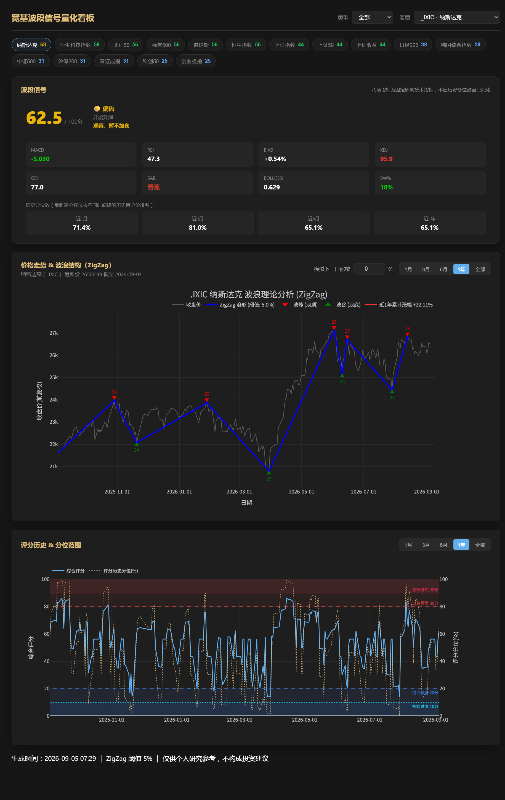
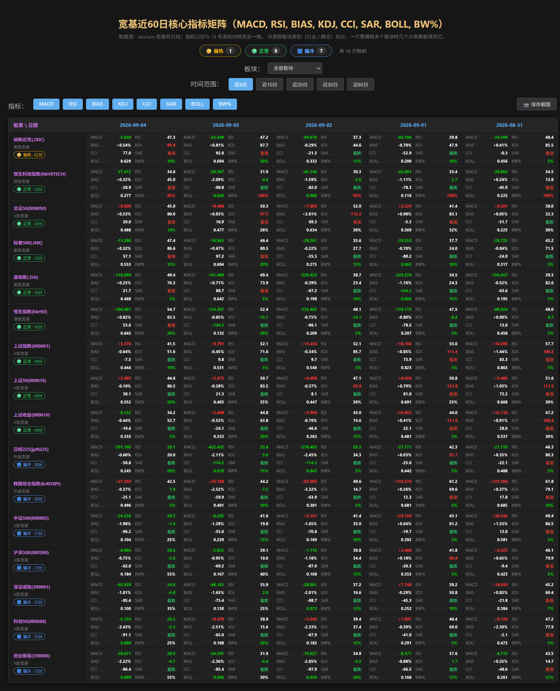
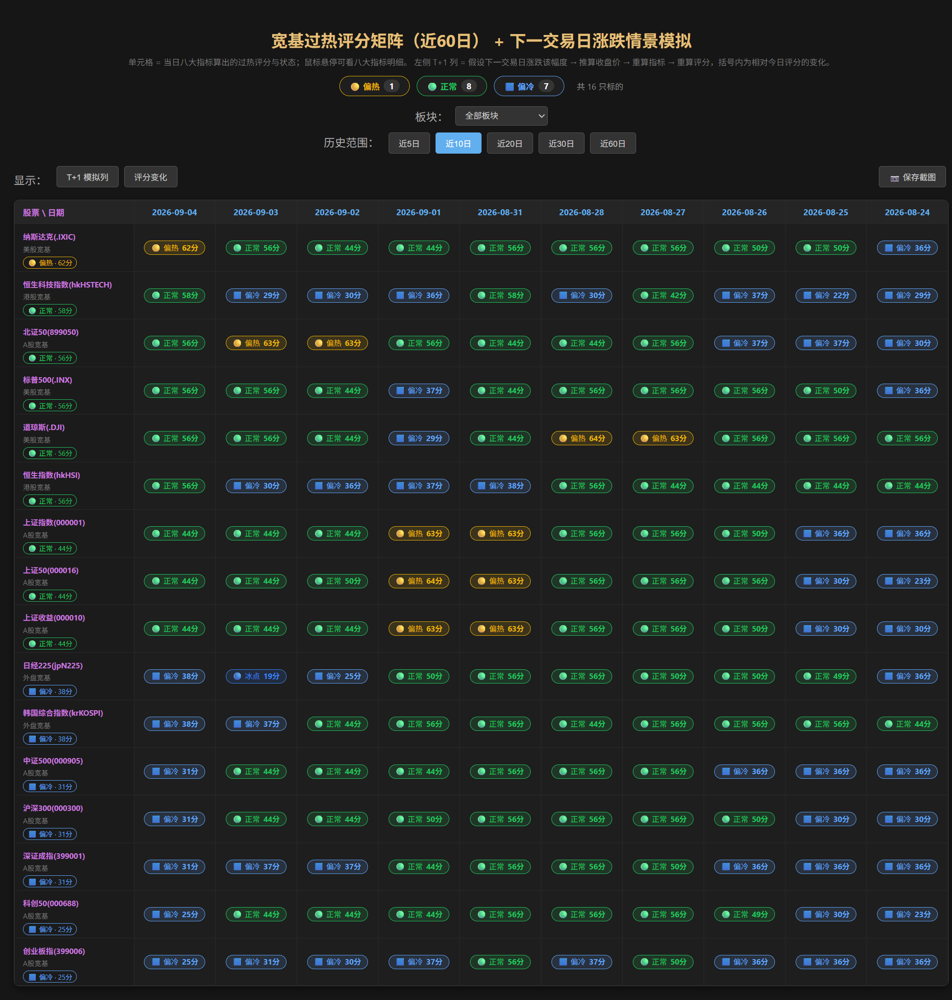
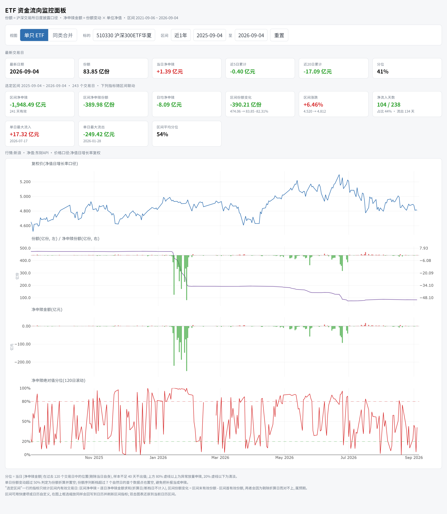
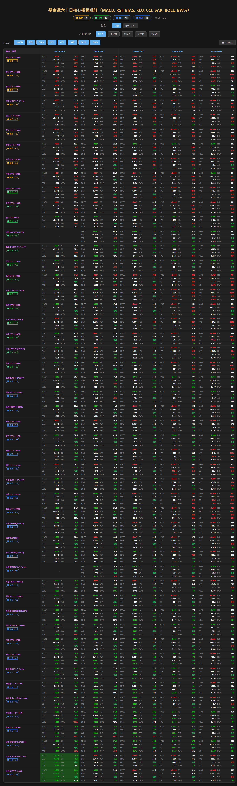
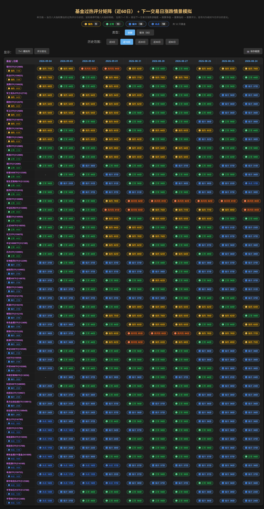
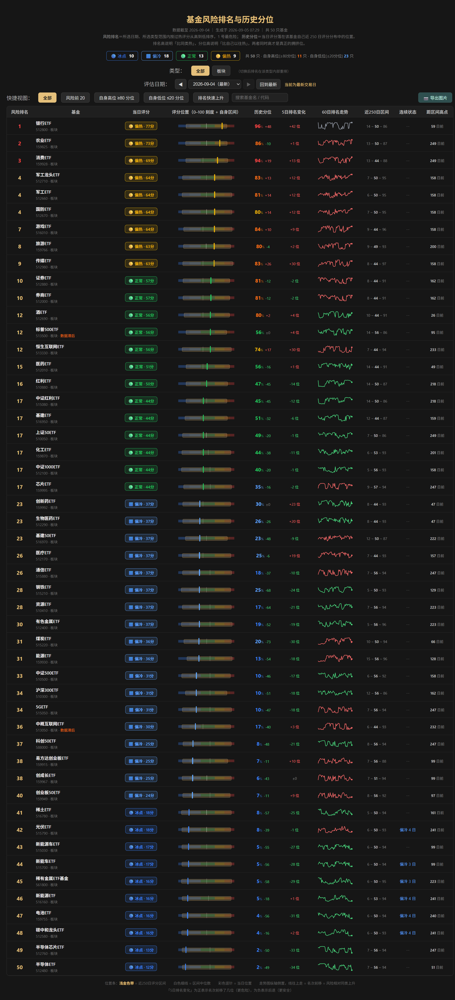
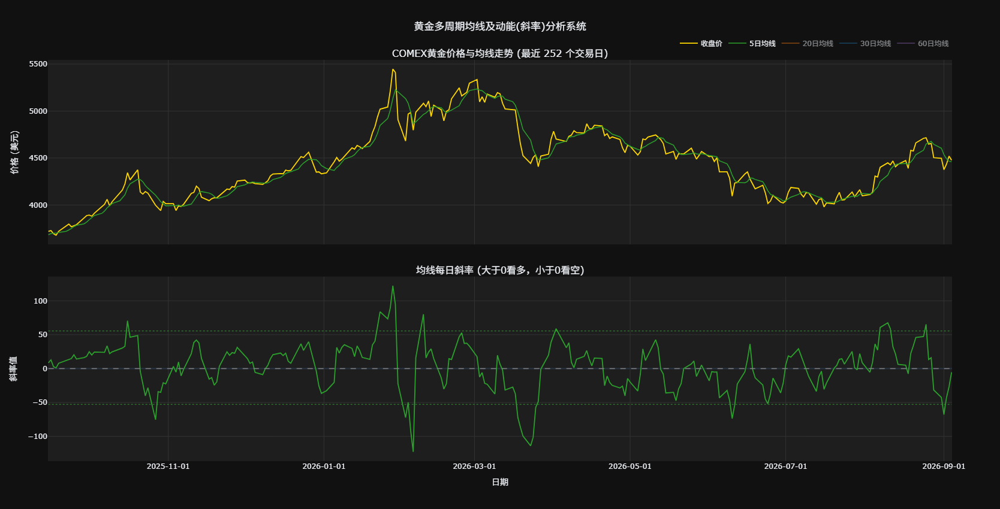

<div align="center">

# 📊 broad-index-dashboard

**A股宽基指数 / 板块基金 / 黄金 的量化分析工具集**

每个脚本产出一份自带交互的单文件 HTML（Plotly 渲染），双击打开就能用，
不需要装浏览器插件，也不用起本地服务器——每个交易日凌晨还会自动重新生成一份最新的。

[](https://github.com/Owen434/broad-index-dashboard/actions/workflows/daily-update.yml)
[](requirements.txt)
[](https://akshare.akfamily.xyz/)
[](https://plotly.com/python/)
[](#license)




</div>

## 目录

- 🎯 [项目特点](#项目特点)
- 📁 [目录结构](#目录结构)
- 📋 [看板一览](#看板一览)
- 📌 [关于示例数据](#关于示例数据)
- ▶️ [本地运行](#本地运行)
- ⚠️ [已知限制](#已知限制)

## 项目特点

**这套工具不是选股工具，核心目的是帮你判断"现在是不是该逃顶/减仓"**——不是告诉你买什么，
而是在市场明显过热、动能开始衰竭、或者"护盘资金"迹象消失时，提前把警示信号摆在你面前。

<table>
<tr><td width="220">🚨 <b>核心目标：逃顶预警，而不是选股</b></td><td>八大指标（MACD/RSI/KDJ/BOLL等）只要有多个同时冲向历史极值区间，评分矩阵就会用"🔴 过热"这类醒目色块标出来——重点不是提示买入，而是提醒你当前状态已经明显过热，该考虑减仓、落袋为安了。</td></tr>
<tr><td>📉 <b>斜率捕捉动能衰竭，往往比价格更早</b></td><td>均线斜率图（黄金分析尤其依赖这个）盯的是"涨速有没有变慢"：价格可能还在创新高，但斜率已经走平甚至转负——这种"价涨斜率不涨"的背离，常常比价格本身更早暴露趋势见顶的迹象。</td></tr>
<tr><td>🕵️ <b>ETF资金流，观察"国家队"进出场的痕迹</b></td><td>45只宽基ETF的每日净申购/净赎回数据，是判断"护盘资金"（也就是俗称的国家队）什么时候进场吸筹、什么时候悄悄减持撤退的重要线索——大跌行情里宽基ETF突然放量净申购，是值得重点关注的信号。</td></tr>
<tr><td>🎯 <b>只看宽基，不追热点个股</b></td><td>分析对象限定在沪深300、上证50、纳斯达克这类宽基指数和板块类 ETF/基金，一次性看清市场整体状态，不需要盯着几千只个股。</td></tr>
<tr><td>📐 <b>指标算法统一口径</b></td><td>MACD / RSI / BIAS / KDJ / CCI / SAR / BOLL / BW% 八大指标 + ZigZag 波浪辨识 + 过热评分，所有脚本共用同一套内核（<code>zigzag_signal_analyzer.py</code>），换脚本看数据口径不会变。</td></tr>
<tr><td>🖱️ <b>交互式而不是静态图</b></td><td>K线形态、指标矩阵、评分看板都能缩放、切换时间范围、导出截图，不是一张扁平的 PNG。</td></tr>
<tr><td>📦 <b>单文件 HTML，离线可开</b></td><td>Plotly.js 按需内嵌或走本地目录引用，生成的 HTML 拷走就能用，不依赖联网。</td></tr>
<tr><td>🔄 <b>每日自动更新</b></td><td>GitHub Actions 定时跑一遍，最新数据自动发布到本仓库的 GitHub Pages，不用自己维护服务器。</td></tr>
</table>

> ⚠️ 以上信号（暴热色块、斜率背离、ETF资金流异动）都是基于历史数据的技术观察，不是预测，
> 更不构成投资建议——市场是否真的见顶、护盘资金是否真的存在，都需要结合更多信息自行判断。

## 目录结构

```
stocks/   宽基指数看板（K线形态 + 八大指标矩阵 + ZigZag波段看板 + 评分矩阵，四合一）
          含 price_movement_patterns.py（取数 + K线形态识别内核）
funds/    板块基金指标矩阵 / ZigZag信号 / 评分矩阵 / 风险排名百分位
          含 fetch_fund_nav.py（净值历史抓取，其余脚本运行前先跑这个）
          含 zigzag_signal_analyzer.py（指标 + 评分 + 绘图内核，被 stocks/ 复用）
etf/      45只宽基ETF的申赎资金流看板
gold/     COMEX黄金多周期均线与斜率分析
docs/     HTML 输出（GitHub Actions 每个交易日自动重新生成，仅供预览，不建议手动改）
```

## 看板一览
| 分类 | 看板 | 预览 | 在线链接 |
|---|---|---|---|
| **① 宽基指数**（含 ETF 资金流） | 八大指标矩阵 |  | https://owen434.github.io/broad-index-dashboard/stock_8indicators_matrix.html |
| | ZigZag 波段看板 |  | https://owen434.github.io/broad-index-dashboard/stock_zigzag_signal_analyzer.html |
| | 评分矩阵 |  | https://owen434.github.io/broad-index-dashboard/stock_scorematrix.html |
| | 45只宽基ETF资金流看板 |  | https://owen434.github.io/broad-index-dashboard/etf_flow_dashboard.html |
| **② 板块基金** | 八大指标矩阵 |    | https://owen434.github.io/broad-index-dashboard/fund_indicators_matrix.html |
| | 评分矩阵 | | https://owen434.github.io/broad-index-dashboard/fund_score_matrix.html |
| | 风险排名百分位 |  | https://owen434.github.io/broad-index-dashboard/fund_riskrank_percentile.html |
| **③ 黄金** | 多周期均线与斜率 |  | https://owen434.github.io/broad-index-dashboard/gold_ma_slopes_interactive.html |

（链接对应 `docs/` 目录下 GitHub Actions 每个交易日自动重新生成的 HTML，首次运行前打开会 404。）

## 关于示例数据

`funds/funds_universe_example.csv` 只包含公开的板块 ETF（旅游ETF、酒ETF、消费ETF……），
不含任何人的真实持仓。想跑自己关注/持有的基金：复制这份 CSV，把 `基金代码`/`基金名称`
换成你自己的标的，`类型`列填 `板块` 或 `持有` 都可以——网页上的分类按钮会跟着 CSV
里实际出现的类型自动生成，不用改代码。

`stocks/stock_analysis_suite.py` 默认 `BROAD_INDEX_ONLY = True`：只分析约十来个
宽基指数（上证指数、沪深300…），不含个股。

## 本地运行

```bash
pip install -r requirements.txt
cd gold && python gold_ma_slope_analyzer.py
cd ../etf && python etf_broadbase_dashboard.py
cd ../funds && python fetch_fund_nav.py && python fund_indicators_matrix.py && python fund_score_matrix.py && python fund_riskrank_percentile.py
cd ../stocks && python stock_analysis_suite.py
```

跑完直接双击打开对应目录下生成的 `.html` 文件即可。

## 已知限制

- 数据源基于 AKShare 抓取国内财经网站接口，部分环境（尤其是境外网络）偶发限流或超时。
- 生成的 HTML 目前按桌面端宽屏设计，在手机浏览器上体验一般（宽表格需要横向滑动查看），
  暂不是移动端优先的布局。
- `funds/fetch_fund_nav.py` 走的是场外/联接基金的净值接口，`funds_universe_example.csv`
  里如果混了场内 ETF 代码，个别可能抓不到净值（脚本会打印失败列表并跳过，不影响其余基金）。

## 许可证与致谢

### License
本项目采用 [MIT License](LICENSE) 开源协议。

### 致谢与声明
- **数据支持**：本项目底层数据抓取依赖于优秀的开源项目 [AKShare](https://github.com/akfamily/akshare)，在此对开源社区及维护者们表示诚挚的感谢！
- **免责声明**：本项目所有输出的看板、评分、策略与回测结果仅供个人量化学习与技术交流之用，不构成任何投资建议。投资者据此操作，风险自负。
