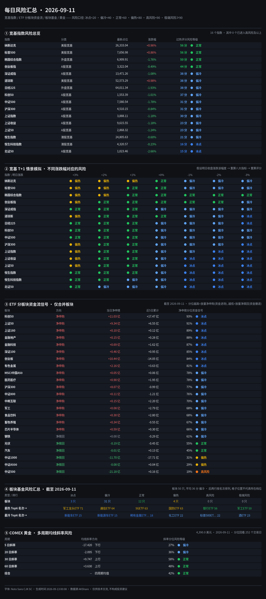

# 每日风险汇总 · 2026-09-11

> 风险口径：`🔵 冰点<20 · 🟦 偏冷<40 · 🟢 正常<60 · 🟡 偏热<80 · 🟠 高风险<90 · 🔴 极端风险≥90`，分位数(0~1)乘 100 后套同一张表。

## ① 宽基指数风险总览

| 指数 | 分类 | 最新点位 | 涨跌幅 | 过热评分 | 风险等级 |
|---|---|---:|---:|---:|---|
| 纳斯达克 | 美股宽基 | 26,333.04 | +0.96% | 56 | 🟢 正常 |
| 标普500 | 美股宽基 | 7,656.98 | +0.86% | 56 | 🟢 正常 |
| 韩国综合指数 | 外盘宽基 | 6,909.91 | -1.76% | 50 | 🟢 正常 |
| 创业板指 | A股宽基 | 3,322.04 | -0.49% | 44 | 🟢 正常 |
| 深证成指 | A股宽基 | 13,471.26 | -1.08% | 38 | 🟦 偏冷 |
| 道琼斯 | 美股宽基 | 52,573.29 | +0.98% | 38 | 🟦 偏冷 |
| 日经225 | 外盘宽基 | 64,011.34 | -1.93% | 38 | 🟦 偏冷 |
| 科创50 | A股宽基 | 1,553.39 | -1.01% | 37 | 🟦 偏冷 |
| 中证500 | A股宽基 | 7,580.54 | -1.78% | 31 | 🟦 偏冷 |
| 沪深300 | A股宽基 | 4,510.15 | -0.84% | 31 | 🟦 偏冷 |
| 上证指数 | A股宽基 | 3,888.11 | -1.18% | 30 | 🟦 偏冷 |
| 上证收益 | A股宽基 | 9,615.55 | -1.18% | 23 | 🟦 偏冷 |
| 上证50 | A股宽基 | 2,868.32 | -1.24% | 23 | 🟦 偏冷 |
| 恒生指数 | 港股宽基 | 24,805.63 | -0.60% | 21 | 🟦 偏冷 |
| 恒生科技指数 | 港股宽基 | 4,320.57 | -0.23% | 16 | 🔵 冰点 |
| 北证50 | A股宽基 | 1,023.46 | -2.66% | 15 | 🔵 冰点 |

## ② 宽基 T+1 情景模拟（不同涨跌幅对应的风险）

| 指数 \ 明日涨跌 | +3% | +2% | +1% | +0% | -1% | -2% | -3% |
|---|---|---|---|---|---|---|---|
| 纳斯达克 | 🟡 偏热 73 | 🟡 偏热 72 | 🟡 偏热 62 | 🟢 正常 56 | 🟦 偏冷 37 | 🟦 偏冷 22 | 🟦 偏冷 21 |
| 标普500 | 🟡 偏热 73 | 🟡 偏热 72 | 🟢 正常 56 | 🟢 正常 56 | 🟦 偏冷 23 | 🟦 偏冷 21 | 🟦 偏冷 21 |
| 韩国综合指数 | 🟡 偏热 75 | 🟡 偏热 63 | 🟢 正常 50 | 🟢 正常 44 | 🟢 正常 44 | 🟢 正常 44 | 🟢 正常 44 |
| 创业板指 | 🟡 偏热 62 | 🟢 正常 56 | 🟢 正常 56 | 🟢 正常 44 | 🟢 正常 44 | 🟢 正常 44 | 🟦 偏冷 37 |
| 深证成指 | 🟢 正常 56 | 🟢 正常 56 | 🟢 正常 44 | 🟦 偏冷 37 | 🟦 偏冷 25 | 🟦 偏冷 23 | 🟦 偏冷 22 |
| 道琼斯 | 🟡 偏热 70 | 🟢 正常 56 | 🟢 正常 56 | 🟢 正常 56 | 🟦 偏冷 22 | 🟦 偏冷 21 | 🔵 冰点 14 |
| 日经225 | 🟢 正常 56 | 🟢 正常 56 | 🟢 正常 44 | 🟦 偏冷 25 | 🟦 偏冷 22 | 🟦 偏冷 22 | 🔵 冰点 15 |
| 科创50 | 🟢 正常 56 | 🟢 正常 56 | 🟢 正常 44 | 🟦 偏冷 37 | 🟦 偏冷 31 | 🟦 偏冷 24 | 🟦 偏冷 23 |
| 中证500 | 🟢 正常 56 | 🟢 正常 56 | 🟢 正常 44 | 🟦 偏冷 31 | 🟦 偏冷 22 | 🟦 偏冷 21 | 🟦 偏冷 20 |
| 沪深300 | 🟡 偏热 63 | 🟢 正常 56 | 🟢 正常 56 | 🟦 偏冷 31 | 🟦 偏冷 22 | 🟦 偏冷 20 | 🔵 冰点 19 |
| 上证指数 | 🟡 偏热 70 | 🟢 正常 56 | 🟢 正常 44 | 🟦 偏冷 30 | 🟦 偏冷 20 | 🔵 冰点 20 | 🔵 冰点 20 |
| 上证收益 | 🟡 偏热 63 | 🟢 正常 56 | 🟢 正常 44 | 🟦 偏冷 23 | 🔵 冰点 20 | 🔵 冰点 20 | 🔵 冰点 18 |
| 上证50 | 🟡 偏热 70 | 🟢 正常 56 | 🟢 正常 44 | 🟦 偏冷 29 | 🔵 冰点 20 | 🔵 冰点 18 | 🔵 冰点 18 |
| 恒生指数 | 🟢 正常 56 | 🟢 正常 56 | 🟢 正常 43 | 🟦 偏冷 22 | 🔵 冰点 14 | 🔵 冰点 12 | 🔵 冰点 12 |
| 恒生科技指数 | 🟢 正常 58 | 🟢 正常 58 | 🟦 偏冷 36 | 🟦 偏冷 23 | 🔵 冰点 16 | 🔵 冰点 14 | 🔵 冰点 8 |
| 北证50 | 🟢 正常 44 | 🟦 偏冷 31 | 🟦 偏冷 24 | 🟦 偏冷 22 | 🔵 冰点 14 | 🔵 冰点 14 | 🔵 冰点 12 |

## ③ ETF 分板块资金流信号（仅合并板块，截至 2026-09-11）

> 分位为**带方向**的滚动分位：越接近 100% = 放量净申购（资金进场，偏机会），越接近 0% = 放量净赎回（资金撤退，偏风险）。

| 板块 | 方向 | 当日净申赎(亿元) | 近5日(亿元) | 净申赎分位 | 资金信号 |
|---|---|---:|---:|---:|---|
| 科创50 | 净申购 | +11.03 | +17.47 | 93% | 🔵 冰点 |
| 上证50 | 净申购 | +9.34 | +6.55 | 91% | 🔵 冰点 |
| 上证180 | 净申购 | +0.10 | +0.12 | 89% | 🔵 冰点 |
| 金融地产 | 净申购 | +0.15 | +0.28 | 88% | 🔵 冰点 |
| 金融科技 | 净申购 | +0.69 | +1.62 | 87% | 🔵 冰点 |
| 深证100 | 净申购 | +0.46 | +0.95 | 85% | 🔵 冰点 |
| 创业板 | 净申购 | +10.44 | -14.05 | 84% | 🔵 冰点 |
| 有色金属 | 净申购 | +2.16 | +3.63 | 81% | 🔵 冰点 |
| MSCI中国A50 | 净申购 | +0.05 | +0.06 | 78% | 🟦 偏冷 |
| 医药医疗 | 净申购 | +0.90 | +1.95 | 78% | 🟦 偏冷 |
| 沪深300 | 净申购 | +8.07 | -0.99 | 77% | 🟦 偏冷 |
| 中证800 | 净申购 | +0.11 | -1.21 | 76% | 🟦 偏冷 |
| 中概互联 | 净申购 | +0.15 | +2.20 | 70% | 🟦 偏冷 |
| 军工 | 净申购 | +0.08 | +2.79 | 68% | 🟦 偏冷 |
| 食品饮料 | 净申购 | +0.30 | +2.80 | 68% | 🟦 偏冷 |
| 畜牧养殖 | 净申购 | +0.34 | -0.55 | 67% | 🟦 偏冷 |
| 芯片半导体 | 净申购 | +0.59 | +0.30 | 66% | 🟦 偏冷 |
| 钢铁 | 净赎回 | +0.00 | -0.29 | 61% | 🟦 偏冷 |
| 光伏 | 净赎回 | -0.19 | -0.45 | 55% | 🟢 正常 |
| 汽车 | 净赎回 | -0.01 | +0.13 | 45% | 🟢 正常 |
| 中证1000 | 净赎回 | -11.70 | -17.71 | 31% | 🟡 偏热 |
| 中证A500 | 净赎回 | -0.08 | +0.04 | 29% | 🟡 偏热 |
| 中证500 | 净赎回 | -21.18 | +0.16 | 19% | 🟠 高风险 |

## ④ 板块基金风险汇总（截至 2026-09-11）

| 类型 / 排行 | 🔵 冰点 | 🟦 偏冷 | 🟢 正常 | 🟡 偏热 | 🟠 高风险 | 🔴 极端风险 |
|---|:---:|:---:|:---:|:---:|:---:|:---:|
| **板块** | 3 只 | 31 只 | 12 只 | 4 只 | 0 只 | 0 只 |
| **最热 Top6（名次 →）** | 1. 军工龙头ETF 71 | 2. 通信ETF 64 | 3. 5GETF 63 | 4. 国防ETF 63 | 5. 银行ETF 56 | 6. 军工ETF 50 |
| **最冷 Top6（名次 →）** | 1. 新能车ETF 15 | 2. 新能源车ETF 15 | 3. 稀有金属ETF基金 18 | 4. 化工ETF 22 | 5. 标普500ETF 22 | 6. 酒ETF 23 |

> **板块** 共 50 只，平均 36 分 🟦 偏冷。第一行是六档的只数分布；后两行按名次从左到右排，格子落在哪一列只表示名次，与该列的档位无关。

## ⑤ COMEX 黄金 · 多周期均线斜率风险

最新价：4,390.0 美元 · 2026-09-11

| 周期 | 均线斜率 | 方向 | 斜率分位 | 风险等级 |
|---|---:|---|---:|---|
| 5 日 | -17.420 | 下行 | 27% | 🟦 偏冷 |
| 20 日 | -2.095 | 下行 | 36% | 🟦 偏冷 |
| 30 日 | +9.747 | 上行 | 58% | 🟢 正常 |
| 60 日 | +3.630 | 上行 | 48% | 🟢 正常 |
| 综合 | -- | 四周期均值 | 42% | 🟢 正常 |

---
生成时间 2026-09-13 00:08　数据源 AKShare。
本页为技术观察，不构成任何投资建议。